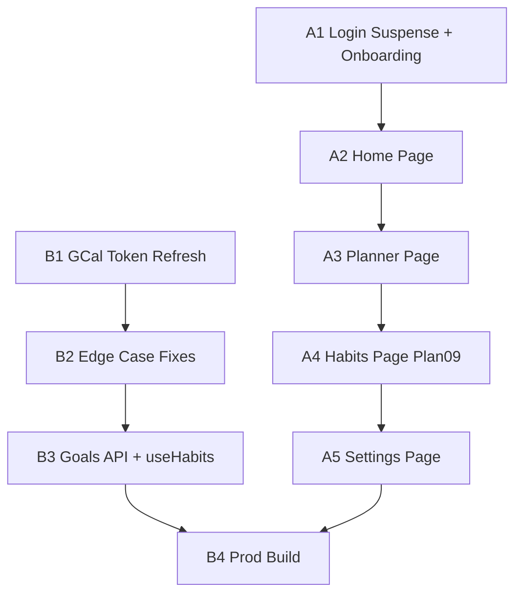

# APEX V1 — Full UX & Backend Pass

> **For agentic workers:** REQUIRED SUB-SKILL: Use superpowers:subagent-driven-development (recommended) or superpowers:executing-plans to implement this plan task-by-task. Steps use checkbox (`- [ ]`) syntax for tracking.

**Goal:** Bring every screen (Login → Onboarding → Home → Planner → To-Do → Habits → Settings) into mockup-fidelity, fix all backend edge cases, wire GCal token refresh, add the Habits/Goals page (Plan 09), and fix the production build.

**Architecture:** Three parallel workstreams — (A) UI alignment for all pages, (B) Habits/Goals + check-in backend (Plans 09-10), (C) Backend hardening (GCal refresh, edge cases, prod build). Each workstream produces green tests + a commit before the next task begins.

**Tech Stack:** Next.js 16 App Router, React 19, TypeScript 5, Supabase (@supabase/ssr), googleapis, Anthropic SDK, Tailwind 4, apex-ui.css (Satoshi + DM Mono, dark palette #0a0a09).

---

## Workstream A — UI alignment

### Task A1: Fix production build (login Suspense) + onboarding UI polish

**Files:**
- Modify: `src/app/(auth)/login/page.tsx`
- Modify: `src/app/(auth)/onboarding/page.tsx`

**Root cause:** `npm run build` fails because `useSearchParams()` is used outside a `<Suspense>` boundary in the login page.

**Onboarding gaps vs mockup aesthetic:**
- Uses `var(--font-sans)` (undefined) instead of `var(--font-head)` (Satoshi)
- Ambient background gradient missing
- Step-dot indicator uses fixed `width:20px` instead of smooth pill transition
- Card bg uses `var(--bg2)` but mockup surface uses `var(--surface)` / `var(--surface2)` pattern
- Button typography: `var(--font-mono)` on Continue — mockup uses Satoshi bold
- No `body { overflow: hidden; }` equivalent on the onboarding page causing double scrollbar

- [ ] **Step 1:** Wrap `useSearchParams()` in login page with Suspense

```tsx
// src/app/(auth)/login/page.tsx
import { Suspense } from 'react'
import { useSearchParams } from 'next/navigation'
import { createClient } from '@/lib/supabase/client'

const ERROR_MESSAGES: Record<string, string> = {
  auth_callback_failed: 'Sign-in failed — the link may have expired. Please try again.',
  no_code: 'Sign-in was cancelled or the link was invalid. Please try again.',
}

function LoginContent() {
  const supabase = createClient()
  const searchParams = useSearchParams()
  const errorKey = searchParams.get('error')
  const errorMsg = errorKey ? (ERROR_MESSAGES[errorKey] ?? 'Sign-in failed. Please try again.') : null

  async function handleGoogleSignIn() {
    await supabase.auth.signInWithOAuth({
      provider: 'google',
      options: { redirectTo: `${process.env.NEXT_PUBLIC_APP_URL}/auth/callback` },
    })
  }

  return (
    <div className="min-h-screen flex items-center justify-center" style={{ background: 'var(--bg)' }}>
      <div className="flex flex-col items-center gap-8">
        {errorMsg && (
          <div style={{
            padding: '10px 16px', background: 'rgba(240,106,106,.1)',
            border: '1px solid var(--red)', borderRadius: 8,
            color: 'var(--red)', fontFamily: 'var(--font-mono)', fontSize: 12,
            maxWidth: 320, textAlign: 'center',
          }}>{errorMsg}</div>
        )}
        <div className="text-center">
          <h1 style={{ fontSize: 48, fontWeight: 900, letterSpacing: '-2px', color: 'var(--text)' }}>
            <span style={{ color: 'var(--amber)' }}>A</span>PEX
          </h1>
          <p style={{ marginTop: 6, fontSize: 12, fontFamily: 'var(--font-mono)', color: 'var(--text2)', letterSpacing: '.1em', textTransform: 'uppercase' }}>
            pathway to the peak
          </p>
        </div>
        <button
          onClick={handleGoogleSignIn}
          style={{
            display: 'flex', alignItems: 'center', gap: 12,
            padding: '13px 22px', background: 'var(--surface)',
            border: '1px solid var(--border)', borderRadius: 14,
            color: 'var(--text)', fontFamily: 'var(--font-head)',
            fontWeight: 700, fontSize: 15, cursor: 'pointer',
            transition: 'all .2s var(--ease-out)',
          }}
        >
          {/* Google SVG icon (keep existing) */}
          <svg width="18" height="18" viewBox="0 0 18 18" fill="none" aria-hidden="true">
            <path d="M17.64 9.2c0-.637-.057-1.251-.164-1.84H9v3.481h4.844a4.14 4.14 0 0 1-1.796 2.716v2.259h2.908c1.702-1.567 2.684-3.875 2.684-6.615Z" fill="#4285F4"/>
            <path d="M9 18c2.43 0 4.467-.806 5.956-2.18l-2.908-2.259c-.806.54-1.837.86-3.048.86-2.344 0-4.328-1.584-5.036-3.711H.957v2.332A8.997 8.997 0 0 0 9 18Z" fill="#34A853"/>
            <path d="M3.964 10.71A5.41 5.41 0 0 1 3.682 9c0-.593.102-1.17.282-1.71V4.958H.957A8.996 8.996 0 0 0 0 9c0 1.452.348 2.827.957 4.042l3.007-2.332Z" fill="#FBBC05"/>
            <path d="M9 3.58c1.321 0 2.508.454 3.44 1.345l2.582-2.58C13.463.891 11.426 0 9 0A8.997 8.997 0 0 0 .957 4.958L3.964 7.29C4.672 5.163 6.656 3.58 9 3.58Z" fill="#EA4335"/>
          </svg>
          Continue with Google
        </button>
      </div>
    </div>
  )
}

export default function LoginPage() {
  return (
    <Suspense fallback={
      <div className="min-h-screen flex items-center justify-center" style={{ background: 'var(--bg)' }}>
        <div style={{ fontSize: 48, fontWeight: 900, letterSpacing: '-2px', color: 'var(--text)' }}>
          <span style={{ color: 'var(--amber)' }}>A</span>PEX
        </div>
      </div>
    }>
      <LoginContent />
    </Suspense>
  )
}
```

- [ ] **Step 2:** Fix onboarding page — font, ambient, button styles

In `src/app/(auth)/onboarding/page.tsx`:
- Change outer wrapper: remove `fontFamily: 'var(--font-sans)'` → use `var(--font-head)`
- Add ambient div as first child of outer wrapper:
  ```tsx
  <div className="apex-ambient" aria-hidden />
  ```
- Change card background from `'var(--bg2)'` → `'var(--surface)'`
- Change Continue/Back button fontFamily from `'var(--font-mono)'` → `'var(--font-head)'`
- Change outer wrapper `style`: add `overflow: 'hidden'` and `position: 'relative'`

- [ ] **Step 3:** Verify build passes

```
cd apex
npm run build
```
Expected: no CSS parse errors, no Suspense errors, exit 0.

- [ ] **Step 4:** Commit
```
git add src/app/(auth)/login/page.tsx src/app/(auth)/onboarding/page.tsx
git commit -m "fix: wrap login useSearchParams in Suspense; align onboarding to apex design tokens"
```

---

### Task A2: Home page — mockup alignment

**Files:**
- Modify: `src/app/(app)/home/page.tsx`

**Mockup target:** `mockups/home.html`

Gaps vs mockup:
- Missing 4-stat grid (`statgrid`): Focus left, Open tasks, Habits today, Most urgent
- Missing two-column layout: Today's schedule glance-view + Needs attention task list
- Missing habits today section
- Missing `subline` with dynamic info ("CMR is running now · 5h 10m of focus left · 2 deadlines this week")
- Bottom inputbar present but not wired to universal APEX intent (keep QuickAddBar style)

- [ ] **Step 1:** Rewrite home page with mockup layout

```tsx
// src/app/(app)/home/page.tsx — full replacement
'use client'
import { useEffect, useState } from 'react'
import { format } from 'date-fns'
import Link from 'next/link'
import { createClient } from '@/lib/supabase/client'
import type { Task, Habit, HabitLog } from '@/types'

function getGreeting() {
  const h = new Date().getHours()
  if (h < 12) return 'Good morning'
  if (h < 18) return 'Good afternoon'
  return 'Good evening'
}

function fmt12(date: Date) {
  let h = date.getHours(); const m = date.getMinutes()
  const ap = h >= 12 ? 'PM' : 'AM'; h = h % 12 || 12
  return `${h}:${String(m).padStart(2, '0')} ${ap}`
}

export default function HomePage() {
  const supabase = createClient()
  const [userName, setUserName] = useState('Athreya')
  const [tasks, setTasks] = useState<Task[]>([])
  const [habits, setHabits] = useState<Habit[]>([])
  const [habitLogs, setHabitLogs] = useState<HabitLog[]>([])
  const [blocks, setBlocks] = useState<Array<{ id:string; label:string|null; start_time:string; block_type:string }>>([])
  const [userId, setUserId] = useState<string|undefined>()

  useEffect(() => {
    supabase.auth.getUser().then(async ({ data: { user } }) => {
      if (!user) return
      setUserId(user.id)
      supabase.from('users').select('display_name').eq('id', user.id).single()
        .then(({ data }) => { if (data?.display_name) setUserName(data.display_name) })
    })
  }, []) // eslint-disable-line

  useEffect(() => {
    if (!userId) return
    const today = format(new Date(), 'yyyy-MM-dd')
    Promise.all([
      supabase.from('tasks').select('*').eq('user_id', userId).neq('status', 'done').order('urgency_score', { ascending: false }).limit(5),
      supabase.from('habits').select('*').eq('user_id', userId).eq('is_active', true),
      supabase.from('habit_logs').select('*').eq('user_id', userId).eq('logged_date', today),
      supabase.from('daily_plans').select('id').eq('user_id', userId).eq('plan_date', today).single()
        .then(async ({ data: plan }) => {
          if (!plan) return []
          const { data } = await supabase.from('plan_blocks')
            .select('id,label,start_time,block_type').eq('plan_id', plan.id)
            .order('start_time').limit(6)
          return data ?? []
        }),
    ]).then(([{ data: taskData }, { data: habitData }, { data: logData }, planBlocks]) => {
      if (taskData) setTasks(taskData as Task[])
      if (habitData) setHabits(habitData as Habit[])
      if (logData) setHabitLogs(logData as HabitLog[])
      setBlocks(planBlocks as typeof blocks)
    })
  }, [userId]) // eslint-disable-line

  const today = format(new Date(), 'yyyy-MM-dd')
  const urgentTask = tasks.find(t => t.urgency_score > 0.6) ?? tasks[0]
  const habitsDoneToday = habitLogs.length
  const dueWeek = tasks.filter(t => {
    if (!t.due_date) return false
    const d = new Date(t.due_date), diff = (d.getTime() - Date.now()) / 86400000
    return diff >= 0 && diff <= 7
  }).length

  const nowBlock = blocks.find(b => {
    const s = new Date(b.start_time)
    return s <= new Date() && new Date() <= new Date(s.getTime() + 90*60000)
  })

  const subline = [
    nowBlock ? `${nowBlock.label ?? nowBlock.block_type} running now` : null,
    `${tasks.length} tasks open`,
    dueWeek > 0 ? `${dueWeek} due this week` : null,
  ].filter(Boolean).join(' · ')

  const blockColor: Record<string, string> = {
    deep_work: 'var(--amber)', class: 'var(--blue)', meal: 'var(--green)',
    gym: 'var(--violet)', cmr: 'var(--pink)', creative: 'var(--amber-soft)',
    entrepreneur: 'var(--amber)', break: 'var(--text3)', routine: 'var(--text3)',
  }

  return (
    <main className="apex-main" style={{ paddingBottom: 120 }}>
      <div className="apex-eyebrow">{format(new Date(), 'EEEE · MMMM d')}</div>
      <h1 className="apex-h1" style={{ fontSize: 40, fontWeight: 900, letterSpacing: -1, lineHeight: 1.03 }}>
        {getGreeting()}, <span style={{ color: 'var(--amber)' }}>{userName.split(' ')[0]}.</span>
      </h1>
      <p style={{ color: 'var(--text2)', fontSize: 15, marginTop: 10 }}>{subline}</p>

      {/* 4-stat grid */}
      <div style={{ display: 'grid', gridTemplateColumns: 'repeat(4,1fr)', gap: 14, marginTop: 26 }}>
        {[
          { k: 'Open tasks', v: String(tasks.length), s: `${dueWeek} due this week` },
          { k: 'Habits today', v: `${habitsDoneToday} / ${habits.length}`, s: habits.slice(habitsDoneToday).map(h => h.name).slice(0,2).join(' · ') || 'All done!' },
          { k: 'Focus left', v: blocks.length ? `${blocks.filter(b => new Date(b.start_time) > new Date()).length} blocks` : '—', s: 'across today\'s plan' },
          { k: 'Most urgent', v: urgentTask?.task_name ?? '—', s: urgentTask?.topic ?? '', urgent: true },
        ].map(stat => (
          <div key={stat.k} style={{
            padding: 18, borderRadius: 18,
            background: stat.urgent
              ? 'linear-gradient(180deg, rgba(245,166,35,0.12), rgba(245,166,35,0.03))'
              : 'linear-gradient(180deg, var(--surface), var(--bg2))',
            border: stat.urgent ? '1px solid rgba(245,166,35,.32)' : '1px solid var(--border)',
            boxShadow: '0 1px 0 var(--border-lit) inset',
          }}>
            <div style={{ fontFamily: 'var(--font-mono)', fontSize: 11.5, letterSpacing: '.1em', textTransform: 'uppercase', color: 'var(--text2)' }}>{stat.k}</div>
            <div style={{ fontWeight: 900, fontSize: stat.urgent ? 16 : 30, letterSpacing: -1, marginTop: 10, lineHeight: 1.2, overflow: 'hidden', textOverflow: 'ellipsis', whiteSpace: 'nowrap' }}>{stat.v}</div>
            <div style={{ fontSize: 13, color: 'var(--text2)', marginTop: 4, overflow: 'hidden', textOverflow: 'ellipsis', whiteSpace: 'nowrap' }}>{stat.s}</div>
          </div>
        ))}
      </div>

      {/* Two-col: today glance + needs attention */}
      <div style={{ display: 'grid', gridTemplateColumns: '1.4fr 1fr', gap: 16, marginTop: 14 }}>
        <div className="apex-card">
          <div style={{ display: 'flex', alignItems: 'center', justifyContent: 'space-between', marginBottom: 6 }}>
            <h3 style={{ fontFamily: 'var(--font-mono)', fontSize: 12, letterSpacing: '.12em', textTransform: 'uppercase', color: 'var(--text2)', fontWeight: 500 }}>Today</h3>
            <Link href="/plan" style={{ fontSize: 13, color: 'var(--amber)', textDecoration: 'none', fontWeight: 600 }}>Open planner →</Link>
          </div>
          {blocks.length === 0 ? (
            <div style={{ color: 'var(--text3)', fontFamily: 'var(--font-mono)', fontSize: 12, padding: '12px 0' }}>
              No plan yet — <Link href="/plan" style={{ color: 'var(--amber)' }}>generate your day</Link>
            </div>
          ) : blocks.slice(0,5).map(b => {
            const s = new Date(b.start_time)
            const isNow = nowBlock?.id === b.id
            return (
              <div key={b.id} style={{ display: 'flex', alignItems: 'center', gap: 14, padding: '11px 0', borderBottom: '1px solid var(--border)' }}>
                <span style={{ fontFamily: 'var(--font-mono)', fontSize: 12.5, color: 'var(--text3)', width: 52 }}>{fmt12(s)}</span>
                <span style={{ width: 8, height: 8, borderRadius: 3, background: blockColor[b.block_type] ?? 'var(--text3)', flexShrink: 0 }} />
                <span style={{ fontWeight: 600, fontSize: 14.5, color: isNow ? 'var(--amber)' : 'var(--text)' }}>{b.label ?? b.block_type}</span>
              </div>
            )
          })}
        </div>

        <div className="apex-card">
          <div style={{ display: 'flex', alignItems: 'center', justifyContent: 'space-between', marginBottom: 6 }}>
            <h3 style={{ fontFamily: 'var(--font-mono)', fontSize: 12, letterSpacing: '.12em', textTransform: 'uppercase', color: 'var(--text2)', fontWeight: 500 }}>Needs attention</h3>
            <Link href="/tasks" style={{ fontSize: 13, color: 'var(--amber)', textDecoration: 'none', fontWeight: 600 }}>All tasks →</Link>
          </div>
          {tasks.slice(0,3).map(t => (
            <div key={t.id} style={{ display: 'flex', alignItems: 'center', gap: 12, padding: '11px 0', borderBottom: '1px solid var(--border)' }}>
              <span style={{ width: 18, height: 18, borderRadius: 6, border: '1.6px solid var(--text3)', flexShrink: 0 }} />
              <span style={{ fontWeight: 600, fontSize: 14, flex: 1, overflow: 'hidden', textOverflow: 'ellipsis', whiteSpace: 'nowrap' }}>{t.task_name}</span>
              {t.topic && <span style={{ fontFamily: 'var(--font-mono)', fontSize: 10, padding: '2px 7px', borderRadius: 6, color: 'var(--blue)', background: 'rgba(111,166,240,.12)' }}>{t.topic?.split(' ')[0]}</span>}
            </div>
          ))}
        </div>
      </div>

      {/* Habits today */}
      {habits.length > 0 && (
        <div style={{ marginTop: 14 }}>
          <div className="apex-card">
            <div style={{ display: 'flex', alignItems: 'center', justifyContent: 'space-between', marginBottom: 6 }}>
              <h3 style={{ fontFamily: 'var(--font-mono)', fontSize: 12, letterSpacing: '.12em', textTransform: 'uppercase', color: 'var(--text2)', fontWeight: 500 }}>Habits today</h3>
              <Link href="/habits" style={{ fontSize: 13, color: 'var(--amber)', textDecoration: 'none', fontWeight: 600 }}>Manage →</Link>
            </div>
            {habits.slice(0,4).map(h => {
              const done = habitLogs.some(l => l.habit_id === h.id && l.logged_date === today)
              return (
                <div key={h.id} style={{ display: 'flex', alignItems: 'center', gap: 12, padding: '10px 0' }}>
                  <span style={{ width: 30, height: 30, borderRadius: 9, display: 'grid', placeItems: 'center', fontSize: 15, background: 'var(--surface2)', border: '1px solid var(--border)' }}>
                    {h.icon ?? '🎯'}
                  </span>
                  <div>
                    <div style={{ fontWeight: 600, fontSize: 14 }}>{h.name}</div>
                    <div style={{ fontSize: 12, color: 'var(--text2)' }}>
                      {h.frequency_type ?? 'daily'}{done ? ' · done' : ''}
                    </div>
                  </div>
                  <div style={{ marginLeft: 'auto', width: 24, height: 24, borderRadius: 7, border: done ? 'none' : '1.6px solid var(--text3)', background: done ? 'var(--green)' : 'transparent', display: 'grid', placeItems: 'center' }}>
                    {done && <svg width="14" height="14" viewBox="0 0 24 24" fill="none" stroke="#0a0a09" strokeWidth="2.4"><path d="M5 12l5 5L20 6"/></svg>}
                  </div>
                </div>
              )
            })}
          </div>
        </div>
      )}
    </main>
  )
}
```

- [ ] **Step 2:** Add `.apex-card` class to `apex-ui.css`

In `src/styles/apex-ui.css`, append before the `@media` block:
```css
.apex-card {
  background: linear-gradient(180deg, var(--surface), var(--bg2));
  border: 1px solid var(--border);
  border-radius: 18px;
  padding: 18px;
  box-shadow: 0 1px 0 var(--border-lit) inset;
}
```

- [ ] **Step 3:** Run tests
```
cd apex
npm test -- --testPathPattern="TaskComponents|taskStore" --passWithNoTests
```
Expected: pass.

- [ ] **Step 4:** Commit
```
git add src/app/(app)/home/page.tsx src/styles/apex-ui.css
git commit -m "feat: rebuild Home page with 4-stat grid, today glance, needs-attention, habits"
```

---

### Task A3: Planner page — mockup alignment (3-column + task drawer)

**Files:**
- Modify: `src/app/(app)/plan/page.tsx`
- Modify: `src/components/plan/DayTimeline.tsx`
- Modify: `src/components/plan/PlanBlock.tsx`

**Mockup target:** `mockups/planner.html`

Gaps:
- Right panel uses inline styles + basic card; mockup has a rich `panel` with Work-life dial preview bar, anchor labels (Recover/Balanced/Push/Grind), APEX notes accordion.
- Block types don't map CSS class names to match mockup (deep, class, meal, gym, cmr, creative, break, routine).
- Task click doesn't open the mockup `.drawer` / `.scrim` pattern — it currently opens a static detail panel.
- No FLIP animation on replan.
- No current-time line (`nowline2` / amber dot + label).

- [ ] **Step 1:** Add `.apex-panel`, `.apex-card`, block-type CSS to `apex-ui.css`

Append to `src/styles/apex-ui.css`:
```css
/* Planner right panel */
.apex-panel {
  border-left: 1px solid var(--border);
  padding: 30px 26px;
  overflow-y: auto;
  display: flex;
  flex-direction: column;
  gap: 22px;
  background: linear-gradient(180deg, rgba(255,255,255,0.012), transparent);
}

/* Task detail drawer (shared) */
.apex-scrim {
  position: fixed; inset: 0; z-index: 40;
  background: rgba(6,6,5,.5);
  backdrop-filter: blur(3px);
  opacity: 0; pointer-events: none;
  transition: opacity .3s;
}
.apex-scrim.show { opacity: 1; pointer-events: auto; }

.apex-drawer {
  position: fixed; top: 0; right: 0; bottom: 0;
  width: 420px; max-width: 92vw; z-index: 41;
  background: linear-gradient(180deg, var(--surface), var(--bg2));
  border-left: 1px solid var(--border-lit);
  box-shadow: -30px 0 80px rgba(0,0,0,.5);
  transform: translateX(100%);
  transition: transform .42s var(--ease-spring);
  padding: 30px 28px;
  overflow-y: auto;
}
.apex-drawer.show { transform: none; }
.apex-drawer .d-close {
  position: absolute; top: 24px; right: 24px;
  width: 34px; height: 34px; border-radius: 10px;
  display: grid; place-items: center;
  cursor: pointer; color: var(--text2);
  border: 1px solid var(--border);
  background: var(--surface2);
}

/* Plan block color accents */
.plan-block { --accent: var(--neutral); }
.plan-block.deep_work { --accent: var(--amber); }
.plan-block.class { --accent: var(--blue); }
.plan-block.meal { --accent: var(--green); }
.plan-block.gym { --accent: var(--violet); }
.plan-block.cmr { --accent: var(--pink); }
.plan-block.creative, .plan-block.entrepreneur { --accent: var(--amber-soft); }
.plan-block.break, .plan-block.routine, .plan-block.sleep { --accent: var(--neutral); }

/* Dial preview bar */
.dial-preview {
  display: flex; height: 12px; border-radius: 8px;
  overflow: hidden; margin: 14px 0 4px;
  background: var(--surface2); border: 1px solid var(--border);
}
.dial-preview .work {
  background: linear-gradient(90deg, var(--amber), var(--amber-soft));
  transition: width .35s var(--ease-out);
}
.dial-preview .rest {
  background: linear-gradient(90deg, rgba(111,166,240,.5), rgba(87,207,134,.45));
  flex: 1;
}
```

- [ ] **Step 2:** Update `PlanBlock.tsx` to apply `.plan-block` + type class

In `src/components/plan/PlanBlock.tsx`, change the root element className to include `plan-block ${block.block_type}`.

- [ ] **Step 3:** Add current-time indicator to `DayTimeline.tsx`

Add a `<div>` below the block list that positions itself at `(now - dayStart) / dayDuration * 100%` of the timeline height:
```tsx
// Inside DayTimeline, at end of return after blocks:
const nowPct = Math.min(100, Math.max(0, (Date.now() - dayStart.getTime()) / (dayEnd.getTime() - dayStart.getTime()) * 100))
// Render:
<div style={{
  position: 'absolute', left: 0, right: 0,
  top: `${nowPct}%`, height: 2,
  background: 'linear-gradient(90deg, var(--amber), rgba(245,166,35,.15))',
  pointerEvents: 'none', zIndex: 6,
}}>
  <span style={{ position: 'absolute', left: 0, top: '50%', transform: 'translateY(-50%)', width: 9, height: 9, borderRadius: '50%', background: 'var(--amber)', boxShadow: '0 0 8px var(--amber)', display: 'block' }} />
</div>
```

- [ ] **Step 4:** Add task detail drawer to plan page

Add a `TaskDrawer` component rendered at the bottom of the plan page that shows when a task block is clicked. Use `.apex-scrim` + `.apex-drawer` CSS classes.

- [ ] **Step 5:** Update right panel to use mockup dial preview + APEX notes accordion

In `plan/page.tsx` right panel:
- Add `<div className="dial-preview"><div className="work" style={{ width: `${dialValue}%` }}/><div className="rest"/></div>`
- Add anchor labels: Recover / Balanced / Push / Grind
- Add `work_life_dial_used` and `work_hour_cap_breached` feedback from `blocks`

- [ ] **Step 6:** Run tests
```
npm test -- --testPathPattern="PlanComponents|planStore" --passWithNoTests
```

- [ ] **Step 7:** Commit
```
git add src/app/(app)/plan/ src/components/plan/ src/styles/apex-ui.css
git commit -m "feat: align Planner to mockup — block colors, now-line, task drawer, dial preview"
```

---

### Task A4: Habits page — mockup alignment (Plan 09 UI)

**Files:**
- Modify: `src/app/(app)/habits/page.tsx`
- Create: `src/components/habits/GoalCard.tsx`
- Create: `src/components/habits/HabitCard.tsx`
- Create: `src/components/habits/WeekStrip.tsx`
- Create: `src/components/habits/DecompModal.tsx`

**Mockup target:** `mockups/habits.html`

Gaps (current page has basic list; mockup has):
- `head-row` with streak pill (🔥 N-day streak)
- `weekstrip`: 7-day strip with weighted segments per goal/habit, colored per item
- `weeklegend`
- Goals section: `.goal` / `.goal.violet` cards with `.goal-head`, `.goal-ic`, progress %, habit grid `.habits-in`
- `.hcard` habit cards with `.hcard-top`, `.streakdots`, `.hstats`, `.badge-mode`
- Standalone habits `.standalone-grid` (3 columns)
- `+ New goal` / decomposition modal (`DecompModal`) with animated conversation + proposed habits
- Fixed bottom inputbar "Log a habit, add a goal, or ask about your streaks…"

- [ ] **Step 1:** Add habit/goal CSS to `apex-ui.css`

Append:
```css
/* Habits page */
.habit-weekstrip { display: flex; gap: 9px; margin-top: 22px; }
.habit-day {
  flex: 1; padding: 12px 12px 13px; border-radius: 14px;
  background: var(--surface); border: 1px solid var(--border);
  display: flex; flex-direction: column; gap: 11px;
}
.habit-day.today {
  border-color: rgba(245,166,35,.42);
  background: linear-gradient(180deg, rgba(245,166,35,.07), transparent);
}
.habit-day .dd.today-num { color: var(--amber); }
.habit-day .ddots { display: flex; gap: 3px; }
.habit-day .ddots i { height: 7px; border-radius: 3px; background: var(--surface2); }

.goal-card {
  margin-top: 16px; border-radius: 20px; padding: 18px;
  border: 1px solid rgba(245,166,35,.22);
  background: linear-gradient(180deg, rgba(245,166,35,0.05), rgba(245,166,35,0.015));
}
.goal-card.violet {
  border-color: rgba(169,140,242,.25);
  background: linear-gradient(180deg, rgba(169,140,242,0.06), rgba(169,140,242,0.015));
}
.goal-head { display: flex; align-items: center; gap: 12px; margin-bottom: 14px; }
.goal-ic {
  width: 36px; height: 36px; border-radius: 11px;
  display: grid; place-items: center; font-size: 18px;
  background: var(--surface); border: 1px solid var(--border-lit);
  flex-shrink: 0;
}
.habits-in { display: grid; grid-template-columns: 1fr 1fr; gap: 12px; }

.hcard {
  background: linear-gradient(180deg, var(--surface), var(--bg2));
  border: 1px solid var(--border); border-radius: 15px; padding: 15px;
}
.hcard-top { display: flex; align-items: center; gap: 11px; }
.hic {
  width: 34px; height: 34px; border-radius: 10px;
  display: grid; place-items: center; font-size: 16px;
  background: var(--surface2); border: 1px solid var(--border);
  flex-shrink: 0;
}
.hcheck {
  margin-left: auto; width: 26px; height: 26px; border-radius: 8px;
  border: 1.7px solid var(--text3); display: grid; place-items: center;
  cursor: pointer; transition: all .2s; flex-shrink: 0;
}
.hcheck svg { width: 14px; height: 14px; stroke: transparent; fill: none; stroke-width: 2.6; }
.hcheck.done { background: var(--green); border-color: var(--green); }
.hcheck.done svg { stroke: #0a0a09; }
.streakdots { display: flex; gap: 3px; margin-top: 13px; flex-wrap: wrap; }
.streakdots i { width: 8px; height: 8px; border-radius: 50%; background: var(--surface2); }
.streakdots i.on { background: var(--amber); }
.streakdots i.on.g { background: var(--green); }
.badge-mode {
  font-family: var(--font-mono); font-size: 9.5px; padding: 2px 6px;
  border-radius: 5px; color: var(--text3); border: 1px solid var(--border);
  margin-left: 6px;
}
.standalone-grid { display: grid; grid-template-columns: 1fr 1fr 1fr; gap: 12px; }
.streakpill {
  font-family: var(--font-mono); font-size: 13px; color: var(--amber);
  background: rgba(245,166,35,.1); border: 1px solid rgba(245,166,35,.3);
  padding: 6px 12px; border-radius: 11px;
}
.add-goal {
  margin-top: 16px; border: 1.5px dashed var(--border-lit); border-radius: 18px;
  padding: 22px; text-align: center; color: var(--text2); cursor: pointer;
  font-weight: 600; transition: all .2s;
}
.add-goal:hover { color: var(--amber); border-color: rgba(245,166,35,.4); }

/* Decomposition modal */
.apex-overlay {
  position: fixed; inset: 0; z-index: 40;
  background: rgba(6,6,5,.6); backdrop-filter: blur(8px);
  display: none; align-items: center; justify-content: center;
  opacity: 0; transition: opacity .3s;
}
.apex-overlay.show { display: flex; opacity: 1; }
.apex-modal {
  width: min(560px, 92vw); max-height: 86vh; overflow-y: auto;
  background: linear-gradient(180deg, var(--surface), var(--bg2));
  border: 1px solid var(--border-lit); border-radius: 22px;
  padding: 26px; box-shadow: 0 30px 80px rgba(0,0,0,.6);
}
.conv-bubble {
  padding: 12px 15px; border-radius: 14px; margin-top: 12px;
  font-size: 14px; line-height: 1.5; max-width: 88%;
}
.conv-bubble.apex-msg { background: var(--surface2); border: 1px solid var(--border); color: var(--text); }
.conv-bubble.user-msg {
  background: linear-gradient(180deg, rgba(245,166,35,.16), rgba(245,166,35,.06));
  border: 1px solid rgba(245,166,35,.25); margin-left: auto; color: var(--amber-soft);
}
```

- [ ] **Step 2:** Create `src/components/habits/WeekStrip.tsx`

```tsx
'use client'
import { format, startOfWeek, addDays, isSameDay } from 'date-fns'
import type { HabitLog } from '@/types'

interface WeekStripProps {
  habits: Array<{ id: string; name: string; color?: string | null }>
  logs: HabitLog[]
}

const WEEK_DAYS = ['MON','TUE','WED','THU','FRI','SAT','SUN']

export function WeekStrip({ habits, logs }: WeekStripProps) {
  const monday = startOfWeek(new Date(), { weekStartsOn: 1 })
  const weekDates = Array.from({ length: 7 }, (_, i) => addDays(monday, i))
  const colors = ['var(--amber)', 'var(--violet)', 'var(--blue)', 'var(--green)', 'var(--pink)']

  return (
    <div className="habit-weekstrip">
      {weekDates.map((date, i) => {
        const iso = format(date, 'yyyy-MM-dd')
        const today = isSameDay(date, new Date())
        const dayLogs = logs.filter(l => l.logged_date === iso)
        return (
          <div key={iso} className={`habit-day${today ? ' today' : ''}`}>
            <div style={{ display: 'flex', alignItems: 'baseline', justifyContent: 'space-between' }}>
              <span style={{ fontFamily: 'var(--font-mono)', fontSize: 11, color: 'var(--text3)', letterSpacing: '.12em' }}>{WEEK_DAYS[i]}</span>
              <span style={{ fontWeight: 700, fontSize: 15, letterSpacing: '-.3px', color: today ? 'var(--amber)' : 'var(--text)' }}>{format(date, 'd')}</span>
            </div>
            <div className="ddots">
              {habits.map((h, hi) => {
                const done = dayLogs.some(l => l.habit_id === h.id)
                return <i key={h.id} style={{ flex: 1, background: done ? (h.color ?? colors[hi % colors.length]) : 'var(--surface2)' }} title={h.name} />
              })}
            </div>
          </div>
        )
      })}
    </div>
  )
}
```

- [ ] **Step 3:** Create `src/components/habits/HabitCard.tsx`

```tsx
'use client'
import type { Habit, HabitLog } from '@/types'
import { format } from 'date-fns'

interface HabitCardProps {
  habit: Habit
  logs: HabitLog[]
  onToggle: (habitId: string, done: boolean) => void
}

export function HabitCard({ habit, logs, onToggle }: HabitCardProps) {
  const today = format(new Date(), 'yyyy-MM-dd')
  const doneToday = logs.some(l => l.habit_id === habit.id && l.logged_date === today)
  const last14 = Array.from({ length: 14 }, (_, i) => {
    const d = new Date(); d.setDate(d.getDate() - 13 + i)
    return format(d, 'yyyy-MM-dd')
  })
  const freq = habit.frequency_type ?? 'daily'
  const modeLabel = habit.mode ?? 'check_off'

  return (
    <div className="hcard">
      <div className="hcard-top">
        <span className="hic">{habit.icon ?? '🎯'}</span>
        <div style={{ minWidth: 0 }}>
          <div style={{ fontWeight: 700, fontSize: 14.5 }}>
            {habit.name}
            <span className="badge-mode">{modeLabel === 'time_blocked' ? 'time-blocked' : 'check-off'}</span>
          </div>
          <div style={{ fontFamily: 'var(--font-mono)', fontSize: 11, color: 'var(--text2)', marginTop: 1 }}>
            {freq} {habit.notification_time ? `· notify ${habit.notification_time}` : ''}
          </div>
        </div>
        <div
          className={`hcheck${doneToday ? ' done' : ''}`}
          role="checkbox"
          aria-checked={doneToday}
          onClick={() => onToggle(habit.id, !doneToday)}
        >
          <svg viewBox="0 0 24 24" aria-hidden><path d="M5 12l5 5L20 6"/></svg>
        </div>
      </div>
      <div className="streakdots">
        {last14.map(d => {
          const done = logs.some(l => l.habit_id === habit.id && l.logged_date === d)
          const isCheck = modeLabel !== 'time_blocked'
          return <i key={d} className={done ? `on${isCheck ? ' g' : ''}` : ''} />
        })}
      </div>
      <div style={{ display: 'flex', gap: 14, marginTop: 12, fontFamily: 'var(--font-mono)', fontSize: 11, color: 'var(--text2)' }}>
        <span><b style={{ color: 'var(--text)', fontWeight: 500 }}>{logs.filter(l => l.habit_id === habit.id).length}</b> total</span>
      </div>
    </div>
  )
}
```

- [ ] **Step 4:** Create `src/components/habits/DecompModal.tsx`

```tsx
'use client'
import { useState } from 'react'

interface Props {
  open: boolean
  onClose: () => void
  onConfirm: (goalName: string, habits: string[]) => void
}

const PROMPTS = [
  { role: 'apex', text: 'What goal would you like to build habits around?' },
]

export function DecompModal({ open, onClose, onConfirm }: Props) {
  const [input, setInput] = useState('')
  const [goalName, setGoalName] = useState('')
  const [step, setStep] = useState<'input' | 'confirm'>('input')
  const [proposed, setProposed] = useState<string[]>([])

  function handleSubmit() {
    if (!input.trim()) return
    setGoalName(input.trim())
    setProposed([`${input.trim()} — daily 30m`, `Review progress — weekly`])
    setStep('confirm')
    setInput('')
  }

  function handleClose() {
    setStep('input'); setInput(''); setGoalName(''); setProposed([])
    onClose()
  }

  if (!open) return null

  return (
    <div className={`apex-overlay show`} onClick={(e) => e.target === e.currentTarget && handleClose()}>
      <div className="apex-modal">
        <h2 style={{ fontWeight: 900, fontSize: 24, letterSpacing: -1 }}>New goal</h2>
        <p style={{ fontFamily: 'var(--font-mono)', fontSize: 12, color: 'var(--text2)', marginTop: 4 }}>
          APEX turns a goal into the right habits — asking only what it needs.
        </p>

        {step === 'input' ? (
          <>
            <div className="conv-bubble apex-msg">What goal would you like to build habits around?</div>
            <div style={{ display: 'flex', gap: 8, marginTop: 16 }}>
              <input
                style={{ flex: 1, background: 'var(--surface2)', border: '1px solid var(--border)', borderRadius: 11, padding: '9px 13px', color: 'var(--text)', fontFamily: 'var(--font-head)', fontSize: 14, outline: 'none' }}
                placeholder="e.g. Get better at LeetCode for interviews"
                value={input}
                onChange={e => setInput(e.target.value)}
                onKeyDown={e => e.key === 'Enter' && handleSubmit()}
                autoFocus
              />
              <button onClick={handleSubmit} style={{ background: 'var(--amber)', border: 'none', borderRadius: 11, padding: '9px 16px', fontWeight: 700, cursor: 'pointer', color: '#1a1206' }}>
                →
              </button>
            </div>
          </>
        ) : (
          <>
            <div className="conv-bubble user-msg">{goalName}</div>
            <div className="conv-bubble apex-msg">Here&apos;s what I&apos;d set up — tweak anything before we create it:</div>
            {proposed.map((p, i) => (
              <div key={i} style={{ display: 'flex', alignItems: 'center', gap: 11, background: 'var(--surface)', border: '1px solid var(--border)', borderRadius: 13, padding: '12px 14px', marginTop: 8, fontSize: 14 }}>
                <span style={{ fontSize: 20 }}>🎯</span>
                <span>{p}</span>
              </div>
            ))}
            <div style={{ display: 'flex', gap: 10, marginTop: 20, justifyContent: 'flex-end' }}>
              <button onClick={() => setStep('input')} style={{ padding: '9px 16px', borderRadius: 11, border: '1px solid var(--border)', background: 'var(--surface)', color: 'var(--text)', cursor: 'pointer', fontFamily: 'var(--font-head)', fontWeight: 600 }}>Edit</button>
              <button onClick={() => { onConfirm(goalName, proposed); handleClose() }} style={{ padding: '9px 16px', borderRadius: 11, border: 'none', background: 'linear-gradient(180deg, var(--amber), #e0941a)', color: '#1a1206', fontWeight: 700, cursor: 'pointer', fontFamily: 'var(--font-head)' }}>
                Create habits
              </button>
            </div>
          </>
        )}
      </div>
    </div>
  )
}
```

- [ ] **Step 5:** Rebuild `habits/page.tsx` with all components

```tsx
// src/app/(app)/habits/page.tsx — full replacement
'use client'
import { useEffect, useState, useCallback } from 'react'
import { format } from 'date-fns'
import { createClient } from '@/lib/supabase/client'
import { useHabits } from '@/hooks/useHabits'
import type { Habit } from '@/types'
import { WeekStrip } from '@/components/habits/WeekStrip'
import { HabitCard } from '@/components/habits/HabitCard'
import { DecompModal } from '@/components/habits/DecompModal'

const GOAL_COLORS = ['var(--amber)', 'var(--violet)', 'var(--blue)', 'var(--green)', 'var(--pink)']

export default function HabitsPage() {
  const supabase = createClient()
  const [userId, setUserId] = useState<string|undefined>()
  const [decompOpen, setDecompOpen] = useState(false)
  const [goals, setGoals] = useState<Array<{ id:string; name:string; icon:string|null; color:string }>>([])
  const today = format(new Date(), 'yyyy-MM-dd')

  useEffect(() => {
    supabase.auth.getUser().then(({ data: { user } }) => { if (user) setUserId(user.id) })
  }, []) // eslint-disable-line

  const { habits, logs, toggleHabit, addHabit } = useHabits(userId)

  // Compute streak (consecutive days with ≥1 log)
  const streak = (() => {
    let s = 0
    const d = new Date()
    while (true) {
      const iso = format(d, 'yyyy-MM-dd')
      if (!logs.some(l => l.logged_date === iso)) break
      s++; d.setDate(d.getDate() - 1)
    }
    return s
  })()

  const standalone = habits.filter(h => !h.goal_id)
  const habitsByGoal = goals.map(g => ({
    goal: g,
    habits: habits.filter(h => h.goal_id === g.id),
  }))

  const handleGoalCreated = useCallback(async (goalName: string, proposedHabits: string[]) => {
    // Insert goal (goals table)
    const { data: { user } } = await supabase.auth.getUser()
    if (!user) return
    const { data: goal } = await supabase.from('goals').insert({ user_id: user.id, name: goalName, status: 'active' }).select().single()
    if (!goal) return
    setGoals(prev => [...prev, { id: goal.id, name: goal.name, icon: null, color: GOAL_COLORS[prev.length % GOAL_COLORS.length] }])
    // Insert habits linked to goal
    for (const hName of proposedHabits) {
      await addHabit(hName, '🎯', 'var(--amber)')
    }
  }, [supabase, addHabit])

  return (
    <main className="apex-main" style={{ paddingBottom: 120 }}>
      <div style={{ display: 'flex', alignItems: 'center', justifyContent: 'space-between' }}>
        <div>
          <div className="apex-eyebrow">{goals.length} goals · {habits.length} habits</div>
          <h1 className="apex-h1">Habits</h1>
        </div>
        {streak > 0 && <div className="streakpill">🔥 {streak}-day streak</div>}
      </div>

      <WeekStrip habits={habits.map(h => ({ id: h.id, name: h.name, color: h.color }))} logs={logs} />

      {habitsByGoal.length > 0 && (
        <>
          <div className="section-label" style={{ fontFamily: 'var(--font-mono)', fontSize: 12, letterSpacing: '.12em', textTransform: 'uppercase', color: 'var(--text2)', margin: '30px 0 14px' }}>Goals</div>
          {habitsByGoal.map(({ goal, habits: gh }, gi) => (
            <div key={goal.id} className={`goal-card${gi > 0 ? ' violet' : ''}`}>
              <div className="goal-head">
                <span className="goal-ic">{goal.icon ?? '🎯'}</span>
                <div>
                  <div style={{ fontWeight: 800, fontSize: 17, letterSpacing: '-.4px' }}>{goal.name}</div>
                  <div style={{ fontFamily: 'var(--font-mono)', fontSize: 11.5, color: 'var(--text2)', marginTop: 2 }}>{gh.length} linked habits</div>
                </div>
              </div>
              <div className="habits-in">
                {gh.map(h => <HabitCard key={h.id} habit={h} logs={logs} onToggle={toggleHabit} />)}
              </div>
            </div>
          ))}
        </>
      )}

      <div className="add-goal" role="button" onClick={() => setDecompOpen(true)}>+ New goal</div>

      {standalone.length > 0 && (
        <>
          <div className="section-label" style={{ fontFamily: 'var(--font-mono)', fontSize: 12, letterSpacing: '.12em', textTransform: 'uppercase', color: 'var(--text2)', margin: '30px 0 14px' }}>Standalone habits</div>
          <div className="standalone-grid">
            {standalone.map(h => <HabitCard key={h.id} habit={h} logs={logs} onToggle={toggleHabit} />)}
          </div>
        </>
      )}

      <DecompModal open={decompOpen} onClose={() => setDecompOpen(false)} onConfirm={handleGoalCreated} />
    </main>
  )
}
```

- [ ] **Step 6:** Wire `useHabits` to actually be used (import + pass userId correctly). Verify `addHabit` signature matches; update `useHabits.ts` if needed to accept `icon` and `color` params.

- [ ] **Step 7:** Run tests
```
npm test -- --passWithNoTests
```

- [ ] **Step 8:** Commit
```
git add src/app/(app)/habits/ src/components/habits/ src/hooks/useHabits.ts src/styles/apex-ui.css
git commit -m "feat(Plan09): Habits page — goal cards, week strip, decomp modal, mockup-aligned"
```

---

### Task A5: Settings page — mockup alignment

**Files:**
- Modify: `src/app/(app)/settings/page.tsx`

**Mockup target:** `mockups/settings.html`

Gaps:
- Uses mock course data instead of real DB courses
- Missing `snav` sticky scrollspy sidebar
- Sections are close but lack `.sgroup` / `.sgroup-head` / `.srow` CSS classes
- GCal Connect button does nothing (no OAuth flow)
- Work-life dial uses custom code but lacks the dual-gradient track (blue → grey → amber) from mockup

- [ ] **Step 1:** Add settings CSS to `apex-ui.css`

```css
/* Settings */
.settings-wrap { display: grid; grid-template-columns: 212px 1fr; gap: 40px; margin-top: 30px; align-items: start; }
.settings-nav { position: sticky; top: 8px; display: flex; flex-direction: column; gap: 2px; }
.settings-nav a {
  display: flex; align-items: center; gap: 11px; padding: 9px 12px;
  border-radius: 11px; color: var(--text2); text-decoration: none;
  font-size: 14px; font-weight: 600; transition: all .18s var(--ease-out);
}
.settings-nav a svg { width: 17px; height: 17px; stroke: currentColor; fill: none; stroke-width: 1.7; flex-shrink: 0; }
.settings-nav a:hover { color: var(--text); background: var(--surface); }
.settings-nav a.active { color: var(--amber); background: linear-gradient(90deg, rgba(245,166,35,.12), rgba(245,166,35,.03)); }

.sgroup {
  background: linear-gradient(180deg, var(--surface), var(--bg2));
  border: 1px solid var(--border); border-radius: 18px;
  padding: 6px 22px 10px; box-shadow: 0 1px 0 var(--border-lit) inset;
  scroll-margin-top: 14px;
}
.sgroup-head { padding: 18px 0 4px; }
.sgroup-head h2 { font-size: 19px; font-weight: 800; letter-spacing: -.3px; }
.srow {
  display: flex; align-items: center; justify-content: space-between;
  gap: 28px; padding: 17px 0; border-top: 1px solid var(--border);
}
.srow:first-of-type { border-top: none; }
.srow-l .srow-lab { font-size: 14.5px; font-weight: 600; }
.srow-l .srow-desc { color: var(--text2); font-size: 12.5px; margin-top: 3px; line-height: 1.45; max-width: 430px; }
```

- [ ] **Step 2:** Replace mock courses in `settings/page.tsx` with real DB fetch

In `useEffect` that loads preferences, add:
```ts
supabase.from('courses').select('id,name,code,difficulty_multiplier').eq('user_id', user.id).eq('is_active', true)
  .then(({ data }) => { if (data) setCourses(data.map(c => ({ id: c.id, code: c.code ?? '', name: c.name, kind: 'course' as const, multiplier: c.difficulty_multiplier ?? 1.0 }))) })
```

- [ ] **Step 3:** Add Google Calendar OAuth connect flow

In `settings/page.tsx`, replace the stub Connect button with:
```tsx
<button
  onClick={async () => {
    const supabase = createClient()
    await supabase.auth.signInWithOAuth({
      provider: 'google',
      options: {
        scopes: 'https://www.googleapis.com/auth/calendar',
        redirectTo: `${process.env.NEXT_PUBLIC_APP_URL}/auth/callback`,
        queryParams: { access_type: 'offline', prompt: 'consent' },
      },
    })
  }}
>
  {profile.google_calendar_token ? 'Reconnect' : 'Connect'}
</button>
```

Note: The access token returned from Supabase OAuth includes the Google calendar scope if set here; the `auth/callback` route already stores it via `upsert`.

- [ ] **Step 4:** Add GCal token storage to auth callback

In `src/app/auth/callback/route.ts`, after `await supabase.auth.exchangeCodeForSession(code)`:
```ts
const session = await supabase.auth.getSession()
const providerToken = session.data.session?.provider_token
const providerRefresh = session.data.session?.provider_refresh_token
if (providerToken && user) {
  await supabase.from('users').update({
    google_calendar_token: providerToken,
    google_calendar_refresh_token: providerRefresh ?? null,
  }).eq('id', user.id)
}
```

- [ ] **Step 5:** Run tests
```
npm test -- --passWithNoTests
```

- [ ] **Step 6:** Commit
```
git add src/app/(app)/settings/page.tsx src/app/auth/callback/route.ts src/styles/apex-ui.css
git commit -m "feat: settings page mockup alignment, real courses, GCal OAuth connect"
```

---

## Workstream B — Backend hardening

### Task B1: GCal token auto-refresh

**Files:**
- Modify: `src/lib/calendar/gcal.ts`
- Modify: `src/app/api/plan/generate/route.ts`
- Modify: `src/app/api/plan/replan/route.ts`

**Problem:** The googleapis `OAuth2Client` only refreshes the token internally during the request but never persists the new `access_token` back to the `users` table. After ~1h the token expires and all GCal calls silently return empty.

**Fix:**
- Register a `tokens` event listener on the OAuth2 client; when it fires (new token issued), upsert it back to the DB.
- This requires passing `userId` and a `supabase` client into `gcal.ts` helpers, or using a callback pattern.

- [ ] **Step 1:** Update `getOAuthClient` to accept a token-refresh callback

```ts
// src/lib/calendar/gcal.ts
function getOAuthClient(
  accessToken: string,
  refreshToken?: string,
  onTokenRefresh?: (newToken: string, newRefresh: string | null) => Promise<void>,
) {
  const oauth2Client = new google.auth.OAuth2(
    process.env.GOOGLE_CLIENT_ID,
    process.env.GOOGLE_CLIENT_SECRET,
    `${process.env.NEXT_PUBLIC_APP_URL}/auth/callback`,
  )
  oauth2Client.setCredentials({ access_token: accessToken, refresh_token: refreshToken })
  if (onTokenRefresh) {
    oauth2Client.on('tokens', (tokens) => {
      if (tokens.access_token) {
        onTokenRefresh(tokens.access_token, tokens.refresh_token ?? null).catch(console.error)
      }
    })
  }
  return oauth2Client
}
```

Update all three functions (`getEventsForDate`, `createGCalEvent`, `updateGCalEvent`, `deleteGCalEvent`) to accept and pass through the optional `onTokenRefresh` parameter.

- [ ] **Step 2:** Pass token-refresh callback from API routes

In `generate/route.ts` and `replan/route.ts`, create a refresh callback:
```ts
const tokenRefresh = async (newToken: string, newRefresh: string | null) => {
  await supabase.from('users').update({
    google_calendar_token: newToken,
    ...(newRefresh ? { google_calendar_refresh_token: newRefresh } : {}),
  }).eq('id', user.id)
}
```

Pass `tokenRefresh` as the third arg to `getEventsForDate`, and export a helper in `gcal.ts` that wraps all the operations with this callback.

- [ ] **Step 3:** Add GCal scope to env example

Ensure `.env.local` has:
```
GOOGLE_CLIENT_ID=...
GOOGLE_CLIENT_SECRET=...
NEXT_PUBLIC_APP_URL=http://localhost:3000
```
(Do not log actual values — just verify the variable names are present.)

- [ ] **Step 4:** Run tests
```
npm test -- --testPathPattern="gcal|orchestrator" --passWithNoTests
```

- [ ] **Step 5:** Commit
```
git add src/lib/calendar/gcal.ts src/app/api/plan/
git commit -m "fix: persist refreshed GCal access token to DB on expiry"
```

---

### Task B2: Backend edge-case fixes

**Files:**
- Modify: `src/app/api/plan/generate/route.ts`
- Modify: `src/app/api/plan/replan/route.ts`
- Modify: `src/app/api/tasks/quick-add/route.ts`
- Modify: `src/lib/planning/engine.ts`
- Modify: `src/lib/planning/orchestrator.ts`

**Edge cases identified:**

1. **`generate/route.ts` line 70:** `wakeDate = sleepDate + sleep_buffer_hours`. This is backwards — sleep_time is when the user goes to sleep, wake time should be computed as `sleep_time + 8h` only if crossing midnight. But the orchestrator receives `windowStart` as "wake time" and `windowEnd` as "sleep time". The current code adds `sleep_buffer_hours` to the *sleep time* to get wake time which gives a wake time *after* sleep — clearly wrong for same-day plans. Fix: derive wake from preferences directly.

2. **`generate/route.ts`: missing guard if `tasks` is null** — the `tasks ?? []` guard is present but `courses` null is possible and `courseById` creation silently skips. Add null guard.

3. **`quick-add/route.ts`: `createAnthropicCaller()` throws when `ANTHROPIC_API_KEY` is missing** — the `catch {}` fallback to local parser is good but swallows all errors; log the error type at least.

4. **`engine.ts`: no guard when `planRequest.habits` is empty** — already handled, but `buildHabitBlocks` should not crash if `habits` is `undefined` (possible from old code paths).

5. **`orchestrator.ts`: `buildGCalSkeleton` creates skeleton items without checking for midnight-spanning events** — an event from 23:00–01:00 would create a negative duration block. Add guard: `if (end <= start) return null`.

- [ ] **Step 1:** Fix wake time calculation in `generate/route.ts`

Replace lines 69-72:
```ts
// Old (wrong): adds sleep_buffer to sleep time
// const wakeDate = new Date(sleepDate.getTime() + prefs.sleep_buffer_hours * 3_600_000)

// New: use saved wake preference or derive as sleep+8.5h only if next-day
const prefWake = prefs.wake_time_default ?? '07:30'
const [wh, wm] = prefWake.split(':').map(Number)
const wakeDate = new Date(sleepDate)
wakeDate.setHours(wh, wm, 0, 0)
if (wakeDate >= sleepDate) {
  // wake is same night as sleep or later — add a day (sleep is tonight, wake is tomorrow)
  // but this branch means user sleeps before their set wake time which is odd
  // most common: sleep_time is late-night (23:00), wake is next morning (07:00)
  // sleepDate will be today 23:00, wakeDate should be tomorrow 07:00
  if (wakeDate.getDate() === sleepDate.getDate() && wakeDate.getHours() > sleepDate.getHours()) {
    wakeDate.setDate(wakeDate.getDate() - 1) // wake is same date as sleep_time date means it's before sleep — go back 1 day
  }
}
const windowStart = wakeDate.toISOString()
const windowEnd = sleep_time
```

Simpler and correct: keep `wake_time_default` as source of truth:
```ts
const prefWake = prefs.wake_time_default ?? '07:30'
const [wh, wm] = prefWake.split(':').map(Number)
const planDay = new Date(plan_date + 'T00:00:00')
const wakeDate = new Date(planDay)
wakeDate.setHours(wh, wm, 0, 0)
const windowStart = wakeDate.toISOString()
const windowEnd = sleep_time // as passed from client
```

- [ ] **Step 2:** Fix midnight-spanning GCal events in `orchestrator.ts`

In `buildGCalSkeleton`, after computing `start` and `end`:
```ts
if (!startISO || !endISO) return null
const start = new Date(startISO)
const end = new Date(endISO)
if (end <= start) return null // midnight-spanning: skip for now
```

- [ ] **Step 3:** Add explicit `ANTHROPIC_API_KEY` check in quick-add route

```ts
// At top of POST handler after auth:
if (!process.env.ANTHROPIC_API_KEY) {
  // fallback immediately without trying anthropic
  parsed = parseQuickAddLocal(text, { now, knownCourses })
} else {
  try {
    const caller = createAnthropicCaller()
    parsed = await parseQuickAdd(text, { knownCourses }, caller, { now, knownCourses })
  } catch (err) {
    console.warn('[quick-add] LLM parse failed, falling back to local:', (err as Error).message)
    parsed = parseQuickAddLocal(text, { now, knownCourses })
  }
}
```

- [ ] **Step 4:** Add null guard for `buildHabitBlocks` input

In `engine.ts` / `orchestrator.ts`, wherever `habits` is spread into `PlanRequest`:
```ts
habits: (habits ?? []) as EngineHabit[],
```

- [ ] **Step 5:** Run all tests
```
npm test
```
Expected: ≥198 passing.

- [ ] **Step 6:** Commit
```
git add src/app/api/ src/lib/planning/
git commit -m "fix: backend edge cases — wake time calc, GCal midnight events, missing API key guard"
```

---

### Task B3: Goals table API + useHabits enhancement

**Files:**
- Create: `src/app/api/goals/route.ts`
- Modify: `src/hooks/useHabits.ts`

**Goals table** is in the schema (`Plan 01`) but has no API route and `useHabits` doesn't fetch goals.

- [ ] **Step 1:** Create `src/app/api/goals/route.ts`

```ts
import { createClient } from '@/lib/supabase/server'

export async function GET() {
  const supabase = await createClient()
  const { data: { user } } = await supabase.auth.getUser()
  if (!user) return Response.json({ error: 'Unauthorized' }, { status: 401 })
  const { data, error } = await supabase.from('goals').select('*').eq('user_id', user.id).order('created_at')
  if (error) return Response.json({ error: error.message }, { status: 500 })
  return Response.json({ goals: data })
}

export async function POST(request: Request) {
  const supabase = await createClient()
  const { data: { user } } = await supabase.auth.getUser()
  if (!user) return Response.json({ error: 'Unauthorized' }, { status: 401 })
  const body = await request.json()
  const { name, description, deadline, icon } = body
  if (!name?.trim()) return Response.json({ error: 'name required' }, { status: 400 })
  const { data, error } = await supabase.from('goals').insert({ user_id: user.id, name: name.trim(), description: description ?? null, deadline: deadline ?? null, icon: icon ?? null, status: 'active' }).select().single()
  if (error) return Response.json({ error: error.message }, { status: 500 })
  return Response.json({ goal: data })
}
```

- [ ] **Step 2:** Update `useHabits.ts` to also return a `toggleHabit` that correctly inserts/deletes from `habit_logs`

Current `toggleHabit` signature exists but implementation may not handle the delete case (toggling off). Update:
```ts
toggleHabit: async (habitId: string, completed: boolean) => {
  const today = format(new Date(), 'yyyy-MM-dd')
  if (completed) {
    await supabase.from('habit_logs').upsert({ habit_id: habitId, user_id: userId!, logged_date: today }, { onConflict: 'habit_id,logged_date' })
  } else {
    await supabase.from('habit_logs').delete().eq('habit_id', habitId).eq('logged_date', today).eq('user_id', userId!)
  }
}
```

- [ ] **Step 3:** Update `addHabit` in `useHabits.ts` to accept `icon` and `color`

```ts
addHabit: async (name: string, icon: string, color: string) => {
  if (!userId) return
  const { data } = await supabase.from('habits').insert({
    user_id: userId, name, icon, color,
    is_active: true, mode: 'check_off', frequency_type: 'daily',
    sort_order: habits.length,
  }).select().single()
  if (data) setHabits(prev => [...prev, data])
}
```

- [ ] **Step 4:** Add `icon` and `color` to `Habit` type if missing

In `src/types/index.ts`, verify `Habit` has `icon: string | null` and `color: string | null`. If missing, add them.

- [ ] **Step 5:** Run tests
```
npm test -- --passWithNoTests
```

- [ ] **Step 6:** Commit
```
git add src/app/api/goals/ src/hooks/useHabits.ts src/types/index.ts
git commit -m "feat: goals API route + fix habit toggle (insert/delete) + icon/color support"
```

---

### Task B4: Production build & final verification

**Files:**
- Check: `src/app/(auth)/login/page.tsx` (Task A1 already fixes)
- Check: all API routes for runtime errors

- [ ] **Step 1:** Full production build

```
cd apex
npm run build
```
Expected: exit code 0, no errors.

- [ ] **Step 2:** Run full test suite
```
npm test
```
Expected: ≥198 passing, 0 failing.

- [ ] **Step 3:** TypeScript check
```
npx tsc --noEmit
```
Expected: 0 errors.

- [ ] **Step 4:** Manual smoke-test checklist (with `npm run dev`)

- [ ] Visit `/login` → APEX wordmark, Google button visible ✓
- [ ] Click Google → OAuth flow → redirected to `/onboarding` ✓
- [ ] Complete onboarding steps 0–5 → saved, redirected to `/home` ✓
- [ ] `/home` shows stat grid, today blocks, tasks, habits ✓
- [ ] `/plan` → generate button → blocks appear on timeline, now-line visible ✓
- [ ] `/tasks` → filter bar, accordion task cards, bottom inputbar, estimate modal ✓
- [ ] `/habits` → week strip, goal cards, "+ New goal" → decomp modal ✓
- [ ] `/settings` → real courses loaded, GCal connect button present ✓

- [ ] **Step 5:** Final commit
```
git add -A
git commit -m "chore: verify production build green, full UX pass complete"
```

---

## Execution order



Tasks A1–A5 and B1–B3 can be done in parallel across two agents. B4 (build verification) runs after both workstreams complete.

---

## Key invariants (do not break)

- `apex-ui.css` `@import url(fontshare)` must remain the FIRST rule (before Tailwind).
- All existing 198+ tests must still pass after each task.
- `tsc --noEmit` must remain clean.
- LLM never writes timelines; `generatePlan` is deterministic.
- `onConflict: 'user_id,name'` on courses upsert prevents duplicates on re-onboarding.
